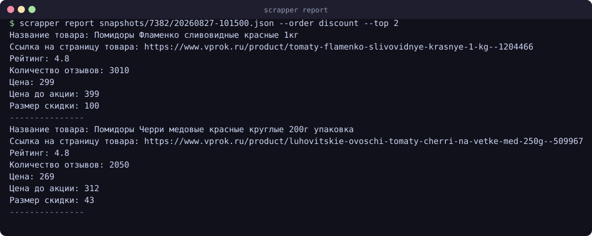
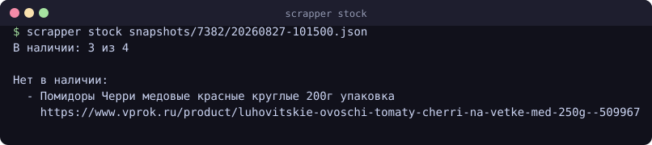
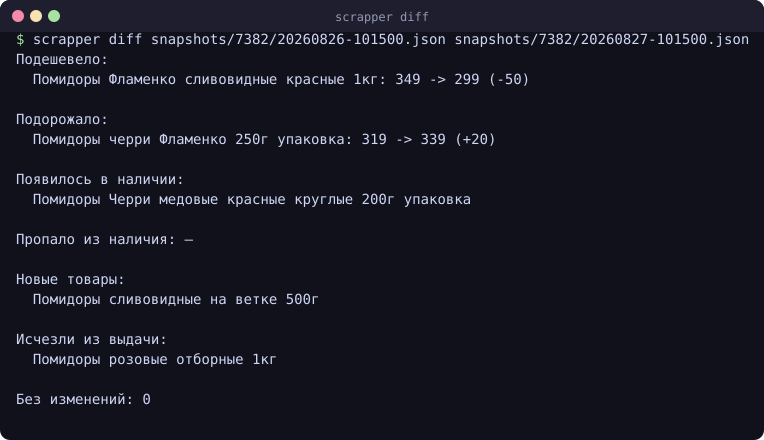
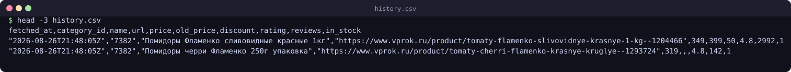

# scrapper-haskell

Инструмент командной строки для наблюдения за каталогом [vprok.ru](https://www.vprok.ru):
скачивает категорию, складывает сырые ответы в снапшоты и отвечает на четыре
практических вопроса — как менялась цена, чего нет в наличии, где настоящая
скидка и что изменилось со вчера.

Браузер не нужен. Запрос к внутреннему API каталога уходит обычным
HTTP-клиентом, куки сессии берутся с главной страницы.

## Возможности

| Задача | Как |
| --- | --- |
| История цен | `fetch --csv history.csv` дописывает строку по каждому товару при каждом прогоне |
| Наличие | `stock` показывает, чего нет в продаже |
| Топ скидок | `report --order discount --top 20` |
| Что изменилось | `diff` сравнивает два снапшота: цены, наличие, состав |

## Установка

Нужны GHC 9.2+ и cabal — проще всего поставить через [ghcup](https://www.haskell.org/ghcup/).

```
git clone <репозиторий>
cd scrapper-haskell
cabal build
```

## Быстрый старт

```
cabal run scrapper -- fetch 7382 --limit 60 --report report.txt --csv history.csv
```

Эта команда скачает категорию, сохранит сырой ответ в
`snapshots/7382/<время>.json`, соберёт текстовый отчёт и допишет историю цен.
Запускайте её по расписанию — и через неделю в `history.csv` будет видно, где
скидка настоящая, а где цену подняли перед тем, как перечеркнуть.

## Команды

### fetch — скачать категорию

Категорию можно задать полной ссылкой, путём каталога или числовым
идентификатором — это одно и то же:

```
cabal run scrapper -- fetch https://www.vprok.ru/catalog/7382/pomidory-i-ovoschnye-nabory
cabal run scrapper -- fetch /catalog/7382/pomidory-i-ovoschnye-nabory
cabal run scrapper -- fetch 7382
```

| Флаг | Значение по умолчанию | Что делает |
| --- | --- | --- |
| `--limit N` | 30 | сколько товаров запросить |
| `--page N` | 1 | номер страницы |
| `--sort S` | `popularity_desc` | сортировка на стороне API |
| `--snapshots DIR` | `snapshots` | куда складывать сырые ответы |
| `--report FILE` | — | записать текстовый отчёт |
| `--csv FILE` | — | дописать историю цен |
| `--order KEY` | `as-is` | порядок товаров в отчёте |
| `--top N` | — | оставить в отчёте первые N товаров |

### report — отчёт из снапшота

Сеть не нужна: отчёт собирается из уже сохранённого файла, поэтому порядок и
глубину можно перебирать сколько угодно.

```
cabal run scrapper -- report snapshots/7382/20260827-101500.json --order discount --top 20
```

Порядок (`--order`): `as-is`, `discount`, `price`, `rating`, `reviews`.



### stock — чего нет в наличии

```
cabal run scrapper -- stock snapshots/7382/20260827-101500.json
```



### diff — что изменилось между прогонами

```
cabal run scrapper -- diff snapshots/7382/20260826-101500.json snapshots/7382/20260827-101500.json
```

Показывает подешевевшие и подорожавшие товары, появившиеся и пропавшие из
наличия, новые позиции и исчезнувшие из выдачи.



## Формат данных

**Снапшот** — сырой ответ API целиком плюс метаданные:

```json
{
  "fetchedAt": "2026-08-27T10:15:00Z",
  "categoryId": "7382",
  "sourceUrl": "/catalog/7382/pomidory-i-ovoschnye-nabory",
  "payload": { "products": [ ... ] }
}
```

Отчёт из снапшота собирается всегда, обратно — нет. Поэтому основной артефакт
здесь снапшот, а `report.txt` — производная от него, которую не жалко удалить.

**История цен** — CSV с колонками `fetched_at`, `category_id`, `name`, `url`,
`price`, `old_price`, `discount`, `rating`, `reviews`, `in_stock`. Файл только
дополняется, так что его можно открыть в чём угодно и построить график.



## Устройство

| Модуль | Ответственность |
| --- | --- |
| `Vprok.Types` | товар, разбор JSON, производные величины (скидка, наличие) |
| `Vprok.Api` | разбор ссылки на категорию, куки, запрос к API |
| `Vprok.Snapshot` | сохранение и чтение сырых ответов |
| `Vprok.Report` | текстовые отчёты и сортировки |
| `Vprok.Diff` | сравнение двух снапшотов |
| `Vprok.Csv` | история цен |
| `Main` | разбор аргументов и склейка |

Разбор и форматирование отделены от ввода-вывода, поэтому команды `report`,
`stock` и `diff` работают на файлах и полностью проверяемы без сети — в
`fixtures/` лежат два снапшота для этого.

## Особенности

- Числа из API приходят то числом, то строкой, то `null` — разбираются все три
  случая, один странный товар не роняет прогон.
- Недоступный товар приходит без цены; на этом построена команда `stock`.
- Размер скидки берётся из API, а если его там нет — считается как разница цен.
- Если вместо JSON приходит HTML (защита от ботов, капча, редирект), программа
  говорит об этом прямо, а не падает ошибкой разбора.

## Ограничения

- Это неофициальный API: состав полей и адрес могут измениться без предупреждения.
- Сайт закрыт защитой от ботов и может отвечать HTML-заглушкой — например, если
  запросы идут с серверного или облачного IP.
- Регион не выбирается — данные приходят для региона по умолчанию.
- За один запрос берётся одна страница категории; для полной выгрузки нужно
  пройти страницы через `--page`.
